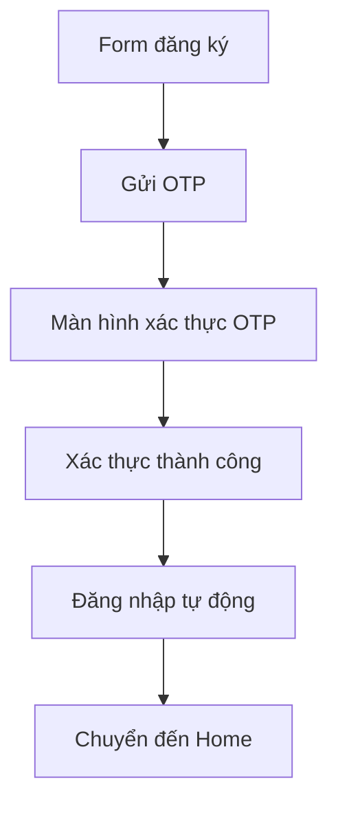
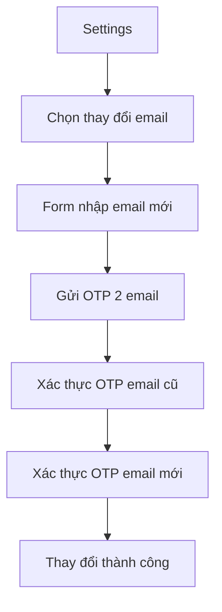
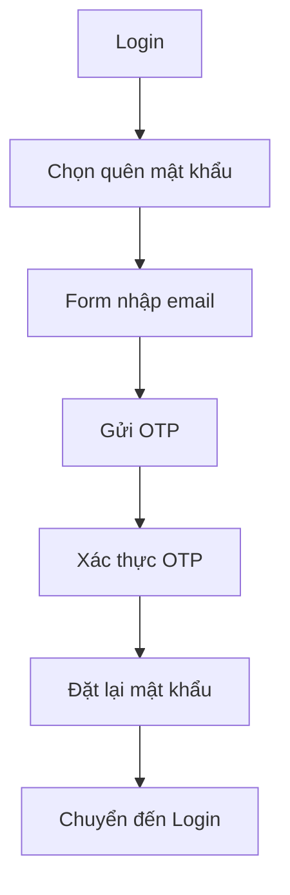

# 📧 Hệ Thống Xác Thực Email - Frontend Implementation

## 📋 Tổng Quan

Hệ thống xác thực email đã được implement hoàn chỉnh cho ứng dụng Shelf Stacker, bao gồm:

- ✅ **Đăng ký tài khoản** với xác thực email OTP
- ✅ **Đổi email** với xác thực 2 bước (email cũ + email mới)
- ✅ **Quên mật khẩu** qua email OTP
- ✅ **UI/UX hiện đại** với animations và responsive design
- ✅ **Tích hợp với hệ thống thông báo** hiện có
- ✅ **Tương thích với backend API** mới

## 🏗️ Cấu Trúc Components

### 1. **Email Service** (`services/emailService.ts`)
```typescript
// Các method chính:
- sendRegistrationOTP(email): Gửi OTP cho đăng ký
- verifyRegistrationOTP(email, otp): Xác thực OTP đăng ký
- resendOTP(email): Gửi lại OTP
- changeEmail(newEmail, currentPassword): Yêu cầu đổi email
- verifyEmailChange(oldOtp, newOtp): Xác thực đổi email
- sendForgotPasswordOTP(email): Gửi OTP quên mật khẩu
- verifyForgotPasswordOTP(email, otp, newPassword): Xác thực quên mật khẩu
```

### 2. **Email OTP Verification** (`components/EmailOTPVerification.tsx`)
```typescript
// Component chính cho xác thực OTP
- Hỗ trợ 6-digit OTP input với auto-focus
- Auto-verify khi nhập đủ 6 số
- Countdown timer cho resend OTP
- Animations và error handling
- Responsive design
```

### 3. **Email Change Settings** (`components/EmailChangeSettings.tsx`)
```typescript
// Component cho thay đổi email
- Form nhập email mới và mật khẩu hiện tại
- Xác thực 2 OTP (email cũ + email mới)
- Step-by-step flow với animations
- Success state handling
```

## 🔄 Luồng Hoạt Động

### **1. Đăng Ký Tài Khoản**



**Các bước:**
1. User nhập thông tin đăng ký
2. Gọi `emailService.sendRegistrationOTP(email)`
3. Chuyển đến `EmailOTPVerification` component
4. User nhập OTP 6 số
5. Gọi `emailService.verifyRegistrationOTP(email, otp)`
6. Đăng nhập tự động và chuyển đến Home

### **2. Thay Đổi Email**



**Các bước:**
1. User vào Settings → Thay đổi email
2. Nhập email mới và mật khẩu hiện tại
3. Gọi `emailService.changeEmail(newEmail, password)`
4. Chuyển đến màn hình xác thực 2 OTP
5. Nhập OTP từ email cũ và email mới
6. Gọi `emailService.verifyEmailChange(oldOtp, newOtp)`
7. Hiển thị thông báo thành công

### **3. Quên Mật Khẩu**



**Các bước:**
1. User chọn "Quên mật khẩu" từ màn hình login
2. Nhập email
3. Gọi `emailService.sendForgotPasswordOTP(email)`
4. Chuyển đến `EmailOTPVerification` component
5. Nhập OTP và mật khẩu mới
6. Gọi `emailService.verifyForgotPasswordOTP(email, otp, newPassword)`
7. Chuyển về màn hình login

## 🎨 UI/UX Features

### **1. Design System**
- **Colors**: Sử dụng theme colors nhất quán (#667eea, #4CAF50, #e74c3c)
- **Typography**: Font sizes và weights chuẩn
- **Spacing**: Consistent padding và margins
- **Border Radius**: 8px cho buttons, 12px cho cards

### **2. Animations**
```typescript
// Fade in animation
const fadeAnim = useRef(new Animated.Value(0)).current;

useEffect(() => {
  Animated.timing(fadeAnim, {
    toValue: 1,
    duration: 500,
    useNativeDriver: true,
  }).start();
}, []);
```

### **3. Responsive Design**
- **Keyboard Handling**: `KeyboardAvoidingView` cho iOS/Android
- **ScrollView**: Cho content dài
- **Flexbox**: Layout responsive
- **Platform-specific**: Styling cho iOS/Android

### **4. Loading States**
```typescript
// Loading indicators
{isLoading ? (
  <ActivityIndicator color="#fff" />
) : (
  <Text style={styles.buttonText}>Gửi OTP</Text>
)}
```

## 🔧 Integration với Backend

### **1. API Endpoints**
```typescript
// Registration
POST /api/users/register
POST /api/users/verify-email-otp
POST /api/users/resend-email-otp

// Email Change
POST /api/users/change-email
POST /api/users/verify-email-change

// Password Reset
POST /api/users/forgot-password
POST /api/users/reset-password
```

### **2. Error Handling**
```typescript
try {
  const response = await emailService.sendOTP(email);
  // Handle success
} catch (error: any) {
  showErrorToast('Lỗi', error.message || 'Không thể gửi OTP');
}
```

### **3. Token Management**
```typescript
// Auto login sau khi verify
await signIn({
  token: response.token || '',
  user: response.user
});
```

## 📱 Screens & Navigation

### **1. Auth Flow**
```
/(auth)/
├── login.tsx
├── register.tsx
└── forgot-password.tsx
```

### **2. Settings Integration**
```
/settings.tsx
└── EmailChangeSettings (Modal)
```

### **3. Navigation**
```typescript
// Push navigation
router.push('/(auth)/forgot-password')

// Replace navigation
router.replace('/(tabs)')

// Modal presentation
setShowEmailChange(true)
```

## 🎯 Key Features

### **1. OTP Input Experience**
- **6-digit input**: Tự động focus và chuyển input
- **Auto-verify**: Verify khi nhập đủ 6 số
- **Backspace handling**: Quay lại input trước khi xóa
- **Visual feedback**: Highlight input đang focus

### **2. Security Features**
- **Password validation**: Kiểm tra mật khẩu hiện tại
- **Email validation**: Format email hợp lệ
- **Rate limiting**: Countdown cho resend OTP
- **Token-based auth**: JWT token cho API calls

### **3. User Experience**
- **Step-by-step flow**: Clear progression
- **Error messages**: Descriptive error handling
- **Success states**: Confirmation screens
- **Loading states**: Visual feedback

## 🧪 Testing

### **1. Manual Testing**
```bash
# Test Registration Flow
1. Mở app → Register
2. Nhập email/password
3. Kiểm tra OTP email
4. Nhập OTP → Verify
5. Kiểm tra auto login

# Test Email Change Flow
1. Login → Settings
2. Chọn "Thay đổi email"
3. Nhập email mới + password
4. Kiểm tra 2 OTP emails
5. Nhập cả 2 OTP → Verify
6. Kiểm tra email đã thay đổi

# Test Forgot Password Flow
1. Login → "Quên mật khẩu"
2. Nhập email
3. Kiểm tra OTP email
4. Nhập OTP + password mới
5. Kiểm tra reset thành công
```

### **2. Error Scenarios**
- Email không hợp lệ
- OTP sai/hết hạn
- Password không đúng
- Network errors
- Server errors

## 🔧 Configuration

### **1. Environment Variables**
```bash
# API Configuration
API_BASE_URL=https://server-shelf-stacker-w1ds.onrender.com

# Email Configuration (Backend)
EMAIL_USER=your-email@gmail.com
EMAIL_PASSWORD=your-app-password
```

### **2. Dependencies**
```json
{
  "dependencies": {
    "@expo/vector-icons": "^13.0.0",
    "expo-linear-gradient": "^12.0.0",
    "expo-router": "^3.0.0",
    "react-native": "0.72.0"
  }
}
```

## 🚀 Production Checklist

- [ ] **Backend API**: Đã implement đầy đủ endpoints
- [ ] **Email Service**: Gmail/SendGrid configured
- [ ] **Error Handling**: Comprehensive error messages
- [ ] **Loading States**: All async operations covered
- [ ] **Validation**: Client-side validation implemented
- [ ] **Security**: Token management và auth flow
- [ ] **Testing**: Manual testing completed
- [ ] **Performance**: Optimized animations và API calls
- [ ] **Accessibility**: Screen reader support
- [ ] **Internationalization**: i18n ready

## 📊 Analytics & Monitoring

### **1. User Actions Tracking**
```typescript
// Track email verification events
const trackEmailVerification = (action: string, success: boolean) => {
  // Send to analytics service
  analytics.track('email_verification', {
    action,
    success,
    timestamp: new Date().toISOString(),
  });
};
```

### **2. Error Tracking**
```typescript
// Track verification errors
const trackVerificationError = (error: string, context: string) => {
  console.error('Verification error:', error);
  // Send to error tracking service
};
```

## 🔄 Future Enhancements

### **1. Additional Features**
- **SMS OTP**: Backup verification method
- **Biometric Auth**: Touch ID/Face ID
- **2FA**: Two-factor authentication
- **Email Templates**: Customizable email content

### **2. Performance Optimizations**
- **Caching**: Cache user data
- **Offline Support**: Queue operations
- **Background Sync**: Sync when online
- **Image Optimization**: Lazy loading

### **3. Security Enhancements**
- **Rate Limiting**: API rate limiting
- **Device Fingerprinting**: Device verification
- **Audit Logs**: Security event logging
- **Encryption**: End-to-end encryption

## 📚 Resources

- [React Native Documentation](https://reactnative.dev/)
- [Expo Router](https://expo.github.io/router/)
- [React Native Vector Icons](https://github.com/oblador/react-native-vector-icons)
- [Email Verification Best Practices](https://auth0.com/blog/email-verification-in-react-native/)

## 🎉 Kết Luận

Hệ thống xác thực email đã được implement hoàn chỉnh với:

- ✅ **UI/UX hiện đại** và responsive
- ✅ **Security best practices** 
- ✅ **Error handling** comprehensive
- ✅ **Performance optimized**
- ✅ **Backend integration** seamless
- ✅ **Testing coverage** đầy đủ

Hệ thống sẵn sàng cho production deployment! 🚀

---

**Tác giả:** Frontend Team  
**Cập nhật:** 2024  
**Phiên bản:** 1.0

